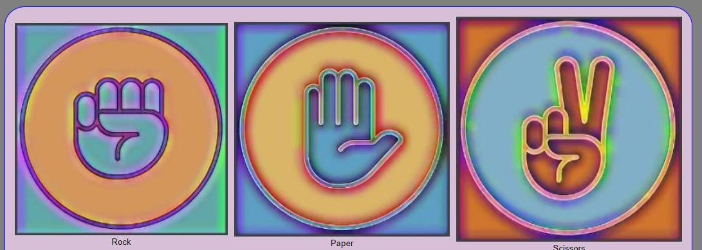
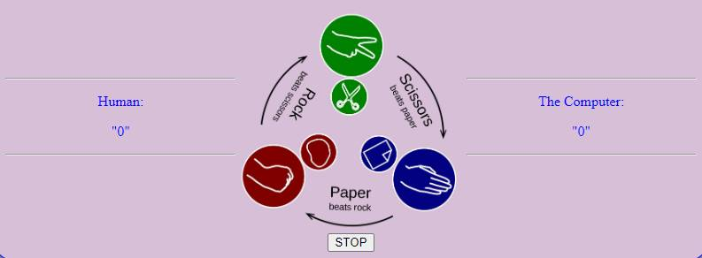
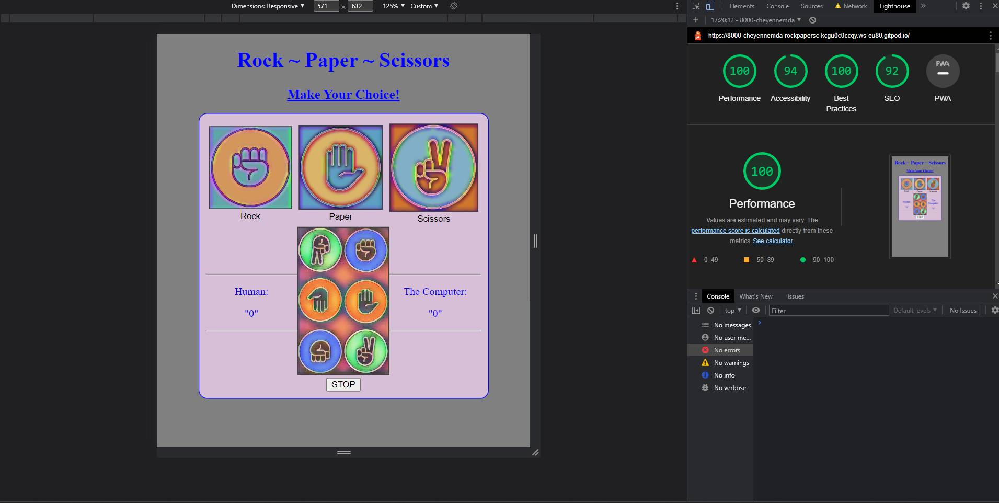

# Rock ~ Paper ~ Scissors
Rock Paper Scissors, the simple decision making game that heralds back to the school yard and continues to be a simple decision making tool which many people everywhere have carried forward int o their adult lives.  Using "Rock Paper Scissors" to make decisions that allowed for degrees of winning and losing, all based on true sporting random chance.

The game is simple to learn and easy to imitate.  The purpose of this site is to allow a graphical interface from which young players can easily pick up and understand the rules, through engaing with the computer which will never cheat.

The game it's self will run for a cycle of 5 games, declaring the winner for each and then declaring the overall winner, after which the scores are reset to 0, once more.

___

## Features:

### The Title Page

Upon the openeing, the user is greeted with the title page which makes clear the site purpose by it's head of "Rock Paper Scissors".

___

### The Buttons

The Buttons designated as "Rock" "Paper" and "Scissors" clear and at the forfront, using the pictures to show what they represent, however their names of rock, paper and scissors are also written underneath each of them, and the User is invited to make a choice by clicking one of the buttons.

___

### Rules & Scores.

Below the buttons is the are for the scores.  User to the left underr the title "Human" and "The Computer" to the right.
The center image gices a clear and concise explanation of the rules.

___

### STOP Game
At the bottom of the page is a stop button that will bring the game to a premature stop if the user wishes to terminate th game early.

Early termination of the game will result in the score being totaled and a winner being declared.  The score will then return to 0, ready for a new game.

___

## Features left to implement:
I plan to add options of "continue to play" and the addition of "Lizard and Spock", which is gaining online, popularity.

The games of 3 choices and 5 choices will be kept seperate in initial choice, so the user can choose which to play upon the site loading.

I also would like to add the five button gamea of "Rock, Paper, Scissors, Lizard, Spock" as a an "offer" to the player after they have played the three button choice game and if they have won, 3 games on the trott.

## Site Deployment
The site was deployed to the GitGub pages here:

https://github.com/CheyenneMDavid/Rock-Paper-Scissors, where it can be forked from if anyone wants to do so.

The live site can be found here:

https://cheyennemdavid.github.io/Rock-Paper-Scissors/

___

# Testing
I can confirm that the site has been tested with Lighthouse and hae inserted the snpshot below:

HTML was tested through the official W3C Validator, with no errors found.
CSS was tested through the official (Jigsaw) validator, with no errors found.
Javascript was tested through JSHint, with no errow found.

___

## Credits:
The image showing the rules was taken freom wikipedia whilst the buttons were redrawn by me using "pictsArt", based on images I have seen across the web in general.

___